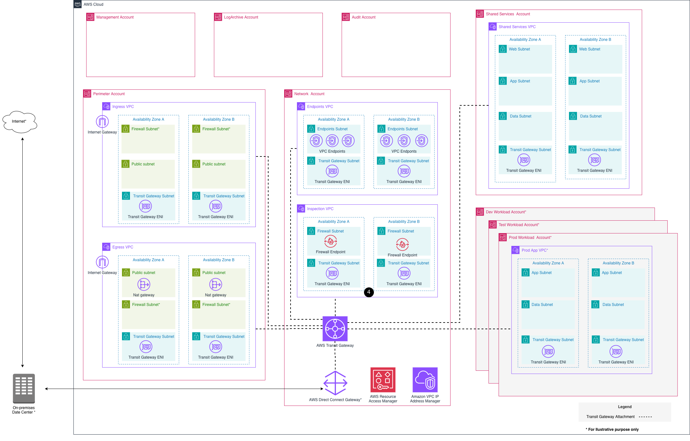

[#us-federal]
= US Federal

== Introduction

This guidance is relevant for customers managing regulated workloads that are typically subject to Federal Information Security Modernization Act (FISMA) and equivalent U.S. state and local regulations. It may be applicable to agencies, contractors, educational institutions, or other organizations responsible for designing or operating systems storing or transmitting sensitive data. It provides recommendations for implementing unique technical control requirements and considerations for operating workloads in AWS Regions that offer enhanced capabilities for FedRAMP Moderate and High baselines, US International Traffic in Arms Regulations (ITAR), Cybersecurity Maturity Model Certification (CMMC), and Department of Defense (DoD) Cloud Computing Security Requirements Guide (SRG) Impact Levels 2, 4, and 5.

The US Federal guidance builds upon the Universal Configuration baseline with additional controls, configurations, and best practices tailored to meet federal compliance requirements and AWS GovCloud (US) deployment considerations.

== Target Audience

* US Federal agencies deploying AWS environments
* Federal system integrators and contractors
* Entities pursuing FedRAMP authorization
* Federal cloud architects and security teams

== LZA Universal Configuration for AWS GovCloud (US)

=== Overview

The LZA Universal Configuration for link:https://docs.aws.amazon.com/govcloud-us/latest/UserGuide/whatis.html[AWS GovCloud (US)] accelerates cloud adoption by providing a pre-configured foundation designed to support compliance efforts, specifically designed for US federal workloads. Instead of spending months architecting and configuring your GovCloud environment from scratch, you can deploy a production-ready landing zone that already incorporates security requirements and best practices.

The configuration uses the base hub and spoke network topology, providing the same architecture and security controls as the standard region deployment. This configuration addresses the unique characteristics of GovCloud regions - including separate account structures, identity management, and service availability - ensuring your deployment is optimized for the cloud environment from day one.

=== Architecture

The LZA Universal Configuration for AWS GovCloud is architected to follow the Defense Information Systems Agency (DISA) Cloud Computing Security Requirements Guide (CC SRG) for hosting Impact Level (IL)4 and IL5 workloads in the cloud when deployed in AWS GovCloud (US) Regions. Using this solution, you can deploy an architecture baseline that accommodates US Federal and DoD requirements to rapidly achieve Authority to Operate (ATO).

[NOTE]
While the LZA Universal Configuration can help you align with frameworks and best practices, customers are responsible for their own ATO readiness.

=== Service Availability

Certain AWS services used in the standard Universal Configuration are not available in AWS GovCloud (US) Regions. The Universal Configuration for AWS GovCloud (US) has these services pre-configured to be excluded:

* Amazon Macie
* Central Root User Management
* AWS Config Rules:
** `codebuild-project-artifact-encryption`

[NOTE]
Not all AWS services are available in all Regions, including the AWS GovCloud (US) Regions. Refer to the link:https://aws.amazon.com/about-aws/global-infrastructure/regional-product-services/[AWS Regional Services list] for current service availability.

=== Configuration Selection

Use the LZA Universal Configuration for AWS GovCloud (US) deployments:

link:https://github.com/aws/lza-universal-configuration/releases[`lza-universal-config-hub-and-spoke-for-govcloud-us`]

This configuration is optimized for AWS GovCloud (US) Regions.

=== Multi-Partition Deployment

An installation into AWS GovCloud (US) Regions is treated as an independent installation of the LZA Universal Configuration. You can use this configuration to manage your corresponding standard AWS environment, resulting in two concurrent LZA Universal Configuration-based environments that you can manage in a unified way.

=== Architecture Diagram

The following diagram shows the AWS GovCloud architecture with account types, services, and network connections:

[NOTE]
- AWS Direct Connect Gateway needs to be updated to connect to Virtual Private Gateway which is connected to VPC that hosts firewall, rather than ending at AWS Transit Gateway.
- AWS Network Firewall is used for east-west traffic inspection.
- Internet Gateway (IGW) is provided for both ingress and egress VPCs. Update these based on your requirements in Post-Deployment Considerations.

== Customization for US Federal Requirements

=== Configuration Updates

When deploying the LZA Universal Configuration for GovCloud environments, evaluate and update the following configuration settings based on your requirements:

* Set GovCloud regions as home and enabled regions
* Configure log retention periods to meet your requirements (the default configuration for GovCloud uses 1 year)
* Update network settings for your specific CIDR ranges and connectivity requirements

=== Additional Controls for Consideration

==== Standard Partition Controls

When managing both standard and GovCloud partitions:

* *SCP for Region Isolation*: Implement Service Control Policies to restrict operations to authorized regions in the standard partition
* *SCP for Billing Isolation*: Apply SCPs to separate billing and cost management between partitions

==== All Partition Controls

* *SCP for Authorized Services*: Restrict access to only federally authorized AWS services across all partitions
* *No Internet Access Considerations*: For hub/spoke architectures requiring air-gapped environments, configure VPC endpoints and private connectivity without internet gateway access

== Deployment

=== Prerequisites

To deploy the LZA Universal Configuration in AWS GovCloud (US), verify the following:

* You have an account in an AWS GovCloud (US) Partition that's paired with a management account of an organization in a standard AWS Region
* You're authorized to create accounts in the AWS GovCloud (US) Partition. For more information, refer to the link:https://docs.aws.amazon.com/govcloud-us/latest/UserGuide/[AWS GovCloud (US) User Guide]
* Vended accounts have a role that can be assumed by the Management account to facilitate joining the organization

=== Creating GovCloud Accounts

You can create GovCloud accounts through your AWS Standard Account using one of two approaches:

*Option 1: Deploy LZA in Standard Accounts*

Deploy the Landing Zone Accelerator in your standard AWS accounts to create and manage GovCloud accounts. This approach is recommended for customers planning to host workloads in both standard and AWS GovCloud (US) Partitions.

For detailed instructions, refer to link:https://docs.aws.amazon.com/solutions/latest/landing-zone-accelerator-on-aws/option-1-deploy-to-new-standard-and-aws-govcloud-us-accounts.html[Deploy to New Standard and AWS GovCloud (US) Accounts].

*Option 2: Deploy Account Vending Machine in Standard Accounts*

Deploy an account vending machine in the standard accounts to create GovCloud accounts. This approach is suitable when you want to limit your use of standard AWS Regions and only use them for account creation.

For detailed instructions, refer to link:https://docs.aws.amazon.com/solutions/latest/landing-zone-accelerator-on-aws/option-2-deploy-on-new-aws-govcloud-us-accounts.html[Deploy on New AWS GovCloud (US) Accounts].

=== Deploy LZA

Once your GovCloud accounts are created, deploy the Landing Zone Accelerator in your AWS GovCloud (US) Management account:

1. Log in to the AWS GovCloud (US) Management account
2. Set up and verify AWS Organizations through email
3. Retrieve GovCloud account IDs from your standard account (refer to Option 1 or Option 2 in the Creating GovCloud Accounts section)
4. Invite AWS GovCloud (US) LogArchive and Audit accounts to your organization
5. Accept the invite by switching to the role for the member account
+
[NOTE]
====
The role is defined as `managementAccountAccessRole` in the `global-config.yaml` configuration file for the AWS standard Management account.
====

6. Deploy link:https://docs.aws.amazon.com/solutions/latest/landing-zone-accelerator-on-aws/deploy-the-solution.html[LZA]
7. Await initial environment deployment

After completion of the preceding steps, your environment is ready to customize.

[IMPORTANT]
Don't use the AWS standard account paired to AWS GovCloud (US) accounts to host any workloads. It should only be used for billing purposes.

=== Apply LZA Universal Configuration for GovCloud

==== Download and Extract Configuration Files

1. Download the appropriate zip file from the latest link:https://github.com/aws/lza-universal-configuration/releases[release]
2. Unzip the configuration files
3. This folder contains config and docs directories. The config directory contains the reference architecture that you want to deploy

==== Prepare Configuration Files

1. Download your local configuration files based on your source link:https://docs.aws.amazon.com/solutions/latest/landing-zone-accelerator-on-aws/step-3.-update-the-configuration-files.html[Configuration Repository Location]
2. Copy the contents from the config folder downloaded from `LZA Universal Configuration` to your local config downloaded from `Configuration Repository Location`. You may be prompted to overwrite duplicate configs, such as `accounts-config.yaml`

==== Mandatory Configuration Files for GovCloud

You need to update and verify the following key configuration files:

===== accounts-config.yaml

Verify and update email addresses and GovCloud account details specific to your environment:

[source,yaml]
----
mandatoryAccounts:
  - name: Management
    description: The management (primary) account
    email: <management-govcloud>@example.com  # <----- UPDATE EMAIL ADDRESS
    organizationalUnit: Root
  - name: LogArchive
    description: The log archive account
    email: <log-archive-govcloud>@example.com  # <----- UPDATE EMAIL ADDRESS
    organizationalUnit: Security
  - name: Audit
    description: The security audit account
    email: <audit-govcloud>@example.com  # <----- UPDATE EMAIL ADDRESS
    organizationalUnit: Security

workloadAccounts:
  - name: SharedServices
    description: The SharedServices account
    email: <shared-services-govcloud>@example.com  # <----- UPDATE EMAIL ADDRESS
    organizationalUnit: Infrastructure
  - name: Network
    description: The Network account
    email: <network-govcloud>@example.com  # <----- UPDATE EMAIL ADDRESS
    organizationalUnit: Infrastructure
  - name: Perimeter
    description: The Perimeter account
    email: <perimeter-govcloud>@example.com  # <----- UPDATE EMAIL ADDRESS
    organizationalUnit: Infrastructure
----

===== replacements-config.yaml

Update the following parameters to match your GovCloud environment:

[source,yaml]
----
globalReplacements:
  ...
  # Home Region - Set to GovCloud region
  - key: HomeRegion
    type: String
    value: us-gov-west-1  # <----- UPDATE TO YOUR GOVCLOUD HOME REGION

  - key: EnabledRegions
    type: StringList
    value:
      - "us-gov-west-1"  # <----- UPDATE TO INCLUDE GOVCLOUD REGIONS
      # - "us-gov-east-1"  # <----- ADD ADDITIONAL GOVCLOUD REGIONS AS NEEDED

  # SNS email notification configuration
  - key: SecurityHigh
    type: String
    value: <notify-high-govcloud>@example.com  # <----- UPDATE EMAIL ADDRESS

  - key: SecurityMedium
    type: String
    value: <notify-medium-govcloud>@example.com  # <----- UPDATE EMAIL ADDRESS

  - key: SecurityLow
    type: String
    value: <notify-low-govcloud>@example.com  # <----- UPDATE EMAIL ADDRESS
  ...
----

==== Additional Customization

Update your environment based on the link:#customization-for-us-federal-requirements[Customization for US Federal Requirements] section to apply additional controls and configurations.

[NOTE]
The default configuration for GovCloud uses 1 year log retention. This is configured in `global-config.yaml` and can be adjusted based on your requirements.

==== Deploy Configuration Changes

After updating the mandatory configuration files and applying additional customizations, push all the changes to your Configuration Repository Location.

[TIP]
Refer to the link:https://docs.aws.amazon.com/solutions/latest/landing-zone-accelerator-on-aws/step-3.-update-the-configuration-files.html[Configuration Repository Location] documentation for specific instructions based on your chosen repository method.

== Post-Deployment Considerations

After deploying LZA and the Universal Configuration for GovCloud, the foundational infrastructure is in place, but additional configuration and applications are required to meet your specific requirements. You need to evaluate your environment and add configurations or deploy applications based on your compliance and operational needs.

The following example demonstrates how to map DoD Secure Cloud Computing Architecture (SCCA) requirements to the deployed Universal Configuration accounts. This is not a complete implementation - you will need to configure additional services and deploy applications within these accounts to fully meet SCCA requirements.

=== SCCA Account Mapping

The Defense Information Systems Agency (DISA) Secure Cloud Computing Architecture (SCCA) provides a standard approach for securing IL4 and IL5 data in cloud environments. The Universal Configuration provides the foundational infrastructure that aligns with SCCA components.

==== Cloud Access Point (CAP)

The Boundary Cloud Access Point (BCAP) or Cloud Access Point (CAP) provides access to cloud environments from the Defense Information Systems Network (DISN) and boundary protection of DISN from the cloud. It includes cyber-defense capabilities such as firewall, intrusion detection systems (IDS), and intrusion prevention systems (IPS). Organizations commonly use the DoD Cloud Native Access Point Reference Design for accessing AWS.

*LZA Universal Configuration Implementation:* The CAP is predetermined by your organization and is not in the scope of this guide. The LZA Universal Configuration provides the foundational network infrastructure in the *Perimeter account* and *Network account* to support CAP connectivity.

==== Virtual Data Center Security Stack (VDSS)

The VDSS protects DoD mission-owner applications hosted in AWS and performs the bulk of security operations in the SCCA. This component contains security and network services, including inbound connectivity access controls, perimeter protection services, web application firewalls, DDoS protection, load balancers, and network routing resources.

*LZA Universal Configuration Implementation:* The LZA Universal Configuration provides the foundational infrastructure in the *Perimeter account* and *Network account* to support VDSS capabilities. You will need to deploy and configure additional security services and applications within these accounts based on your requirements.

==== Virtual Data Center Managed Services (VDMS)

The VDMS provides host security and shared data center services. The functions of VDMS can either run in the hub of your SCCA, or the mission owner can deploy parts of it in their own AWS accounts.

*LZA Universal Configuration Implementation:* The LZA Universal Configuration provides the foundational infrastructure in the *SharedServices account* to host VDMS capabilities. You will need to deploy and configure shared services and applications within this account based on your requirements.

For more information about SCCA requirements, refer to the link:https://public.cyber.mil/stigs/downloads/[DoD Cloud Computing Security Requirements Guide].

== Additional Resources

* link:https://aws.amazon.com/solutions/implementations/landing-zone-accelerator-on-aws[AWS Landing Zone Accelerator on AWS]
* link:https://docs.aws.amazon.com/govcloud-us/latest/UserGuide/[AWS GovCloud (US) User Guide]
* link:https://aws.amazon.com/about-aws/global-infrastructure/regional-product-services[AWS Regional Services]
* link:https://public.cyber.mil/stigs/downloads/[DISA Cloud Computing Security Requirements Guide]
